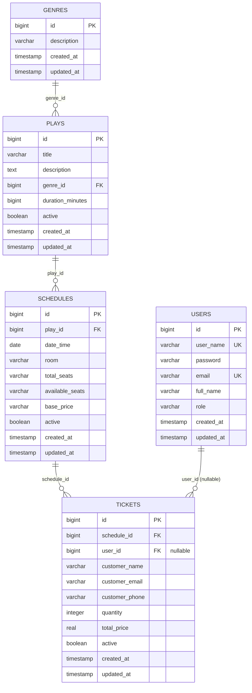

# Sistema de Gestión de Boletería para Teatro — Codesa

Aplicación web para gestionar obras teatrales y la venta de boletas. Permite a los administradores administrar obras, géneros, funciones y compras, y al público consultar funciones disponibles y comprar boletas en línea.

## Stack tecnológico

| Capa | Tecnología | Versión |
|------|-----------|---------|
| Frontend | Angular + Angular Material | 22.0 |
| Backend | Spring Boot | 3.5.2 |
| Base de datos | PostgreSQL | 15 |
| Seguridad | JWT (jjwt) | 0.12.6 |
| Build front | Node.js | 22 |
| Build back | Maven + Java | 17 |

## Funcionalidades

### Público
- Consulta de funciones activas con obras, horarios, sala y precio
- Compra de boletas como invitado (nombre, correo, teléfono)

### Administrador (requiere login)
- Dashboard con accesos rápidos
- **Obras** — CRUD con paginación (título, descripción, género, duración)
- **Géneros** — CRUD con paginación (descripción)
- **Funciones** — CRUD con paginación (obra, fecha, sala, asientos, precio)
- **Compras** — Listado paginado, registro manual de compras, edición, eliminación

### Seguridad
- Autenticación por JWT con tokens de 24 horas
- Roles: `USER` (consulta de compras), `ADMIN` (gestión completa)
- Guards en frontend protegen rutas administrativas

---

## Prerrequisitos

### Opción A: Docker (recomendado)
- [Docker](https://www.docker.com/products/docker-desktop) y Docker Compose

### Opción B: Instalación manual
- [Node.js](https://nodejs.org/) 22+
- [Java JDK](https://adoptium.net/) 17+
- [Maven](https://maven.apache.org/) 3.9+
- [PostgreSQL](https://www.postgresql.org/) 15+

---

## Opción A: Ejecutar con Docker

### 1. Clonar e iniciar

```bash
git clone <repositorio>
cd Prueba\ técnica\ Codesa
docker-compose up --build
```

Esto levanta 3 contenedores:
- `db` — PostgreSQL 15 (puerto 5432)
- `backend` — Spring Boot (puerto 8080)
- `frontend` — Nginx sirviendo Angular (puerto 80)

### 2. Acceder

- **Aplicación pública:** http://localhost (compra de boletas)
- **Panel admin:** http://localhost/login
- **API:** http://localhost:8080/api/v1

---

## Opción B: Instalación manual

### 1. Clonar el repositorio

```bash
git clone <repositorio>
cd Prueba\ técnica\ Codesa
```

### 2. Configurar la base de datos

Crear la base de datos en PostgreSQL y restaurar el dump:

```bash
createdb -U postgres db_codesa
psql -U postgres -d db_codesa -f dump-db_codesa-202607201636.sql
```

### 3. Configurar variables de entorno

Copiar el archivo de ejemplo y editar con tus credenciales:

```bash
cd backend
cp .env.example .env
```

Editar `backend/.env`:

```env
# Base de datos
DB_HOST=localhost
DB_PORT=5432
DB_NAME=db_codesa
DB_USERNAME=postgres
DB_PASSWORD=tu_contraseña

# JWT
JWT_SECRET=clave_secreta_jwt
```

### 4. Iniciar el backend

```bash
cd backend
./mvnw spring-boot:run
```

El backend arranca en http://localhost:8080. La API está disponible en `/api/v1`.

### 5. Iniciar el frontend

```bash
cd front
npm install
npm start
```

El frontend arranca en http://localhost:4200. El proxy redirige `/api` al backend en `:8080`.

### 6. Acceder

- **Aplicación pública:** http://localhost:4200 (compra de boletas)
- **Panel admin:** http://localhost:4200/login
- **API:** http://localhost:8080/api/v1

### Credenciales por defecto

| Rol | Usuario | Contraseña |
|-----|---------|------------|
| Administrador | `admin` | `12345678` |

---

## Variables de entorno

| Variable | Default | Descripción |
|----------|---------|-------------|
| `DB_HOST` | `localhost` | Host de PostgreSQL |
| `DB_PORT` | `5432` | Puerto de PostgreSQL |
| `DB_NAME` | `db_codesa` | Nombre de la base de datos |
| `DB_USERNAME` | `postgres` | Usuario de PostgreSQL |
| `DB_PASSWORD` | `root` | Contraseña de PostgreSQL |
| `JWT_SECRET` | (incluido en `.env.example`) | Clave secreta para firmar tokens JWT |

---

## API Endpoints

### Auth

| Método | Endpoint | Auth |
|--------|----------|------|
| POST | `/api/v1/auth/login` | Público |

### Obras

| Método | Endpoint | Auth |
|--------|----------|------|
| GET | `/api/v1/play/paginated?page=0&size=10` | USER / ADMIN |
| GET | `/api/v1/play/{id}` | USER / ADMIN |
| POST | `/api/v1/play` | ADMIN |
| PUT | `/api/v1/play/{id}` | ADMIN |
| DELETE | `/api/v1/play/{id}` | ADMIN |

### Géneros

| Método | Endpoint | Auth |
|--------|----------|------|
| GET | `/api/v1/genre` | USER / ADMIN |
| GET | `/api/v1/genre/paginated?page=0&size=10` | USER / ADMIN |
| GET | `/api/v1/genre/{id}` | USER / ADMIN |
| POST | `/api/v1/genre` | ADMIN |
| PUT | `/api/v1/genre/{id}` | ADMIN |
| DELETE | `/api/v1/genre/{id}` | ADMIN |

### Funciones

| Método | Endpoint | Auth |
|--------|----------|------|
| GET | `/api/v1/schedule/paginated?page=0&size=10` | USER / ADMIN |
| GET | `/api/v1/schedule/active` | Público |
| GET | `/api/v1/schedule/{id}` | USER / ADMIN |
| POST | `/api/v1/schedule` | ADMIN |
| PUT | `/api/v1/schedule/{id}` | ADMIN |
| DELETE | `/api/v1/schedule/{id}` | ADMIN |

### Tickets / Compras

| Método | Endpoint | Auth |
|--------|----------|------|
| GET | `/api/v1/ticket/paginated?page=0&size=10` | USER / ADMIN |
| GET | `/api/v1/ticket/{id}` | USER / ADMIN |
| POST | `/api/v1/ticket` | USER / ADMIN |
| POST | `/api/v1/ticket/purchase` | Público |
| PUT | `/api/v1/ticket/{id}` | USER / ADMIN |
| DELETE | `/api/v1/ticket/{id}` | ADMIN |

### Usuarios

| Método | Endpoint | Auth |
|--------|----------|------|
| GET | `/api/v1/user/paginated?page=0&size=10` | ADMIN |
| GET | `/api/v1/user/{id}` | ADMIN |
| POST | `/api/v1/user` | ADMIN |
| PUT | `/api/v1/user/{id}` | ADMIN |
| DELETE | `/api/v1/user/{id}` | ADMIN |

---

## Estructura del proyecto

```
├── backend/                          ← Spring Boot (Java 17, Maven)
│   ├── src/main/java/com/codesa/test/
│   │   ├── controller/               ← REST Controllers
│   │   ├── dto/                      ← Request / Response DTOs
│   │   ├── exception/                ← GlobalExceptionHandler
│   │   ├── mapper/                   ← Entity ↔ DTO mappers
│   │   ├── model/entity/             ← JPA Entities
│   │   ├── model/repository/         ← Spring Data JPA Repositories
│   │   ├── security/                 ← JWT filter, SecurityConfig
│   │   ├── service/                  ← Business logic
│   │   └── validation/               ← Custom validators
│   ├── src/main/resources/
│   │   └── application.properties
│   ├── Dockerfile
│   └── pom.xml
│
├── front/                            ← Angular 22 (standalone components)
│   ├── src/app/
│   │   ├── core/
│   │   │   ├── auth/                 ← AuthService, guard, interceptor
│   │   │   ├── model/                ← TypeScript interfaces
│   │   │   └── service/              ← API services
│   │   ├── layouts/admin-layout/     ← Admin shell (toolbar + nav)
│   │   └── pages/
│   │       ├── dashboard/            ← Dashboard
│   │       ├── login/                ← Inicio de sesión
│   │       ├── play/                 ← CRUD obras
│   │       ├── genre/                ← CRUD géneros
│   │       ├── schedule/             ← CRUD funciones
│   │       ├── ticket/               ← CRUD compras
│   │       └── public-purchase.*     ← Compra pública
│   ├── Dockerfile
│   ├── nginx.conf
│   └── proxy.conf.json
│
├── docker-compose.yml                ← Orquestación de contenedores
├── dump-db_codesa-202607201636.sql   ← Script SQL de la base de datos
├── Diagrama Entidad-Relación.png     ← Diagrama ER
├── Teatro Codesa API.postman_collection.json ← Colección Postman
└── README.md
```

---

## Diagrama Entidad-Relación



---

## Colección Postman

Importar `Teatro Codesa API.postman_collection.json` en Postman.  
La colección incluye todos los endpoints organizados por módulo con ejemplos predefinidos.
